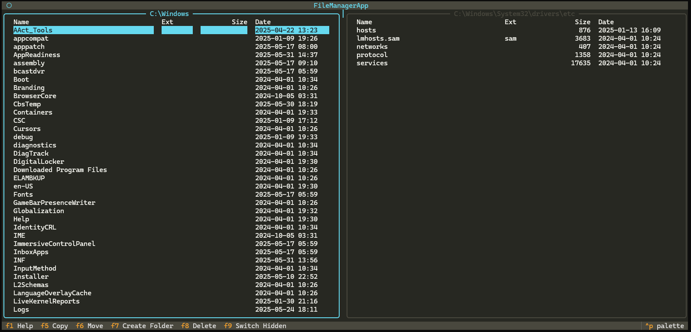

# Cross-Platform Console File Manager

Двухпанельный консольный файловый менеджер с поддержкой мыши, горячих клавиш, массовых операций и мультиязычности (английский/русский).



## 🚀 Новая архитектура (v2.0)

Проект был полностью рефакторинг для улучшения масштабируемости, тестируемости и сопровождаемости:

### ✨ Ключевые улучшения:
- **Модульная архитектура** — код разделен на логические слои
- **Принципы SOLID** — каждый компонент имеет одну ответственность  
- **Менеджеры ресурсов** — централизованное управление конфигурацией, языками и операциями
- **Типизация** — полная поддержка типов Python с mypy
- **Расширяемость** — легко добавлять новые функции и компоненты
- **Тестируемость** — изолированные компоненты для unit-тестирования

### 📁 Новая структура:
```
├── core/                    # Бизнес-логика
│   ├── config_manager.py   # Управление настройками
│   ├── language_manager.py # Локализация  
│   └── file_operations.py  # Файловые операции
├── models/                  # Модели данных
│   ├── file_item.py        # Модель файла/папки
│   └── config.py           # Модель конфигурации  
├── ui/                     # Пользовательский интерфейс
│   ├── dialogs/            # Диалоговые окна
│   └── panels/             # Панели файлов
└── utils/                  # Утилиты и константы
```

Подробности см. в [ARCHITECTURE.md](ARCHITECTURE.md)

## Запуск

### Новая версия (рекомендуется):
```bash
pip install -r requirements.txt
python main_new.py
```

### Старая версия (legacy):
```bash
pip install -r requirements.txt
python main.py
```

## Основные возможности
- Две панели с навигацией, выделением активной панели и вертикальным разделителем
- Массовое копирование, перемещение, удаление файлов и папок (выделение мышью или клавиатурой)
- Поддержка мыши: выделение, множественный выбор (Ctrl/Shift/ПКМ), протяжка, двойной клик для открытия/входа
- Управление с клавиатуры: Tab, стрелки, Enter, Y/N/C, пробел, F5/F6/F7/F8
- Поддержка скрытых файлов (показ/скрытие по хоткею)
- Мультиязычность (en/ru), все тексты вынесены в отдельные файлы
- Тёмная тема (Monokai)
- Сохранение состояния (открытые папки, язык, настройки) между сессиями

## Горячие клавиши
- **Tab** — Переключить активную панель
- **F1** — Help
- **F5** — Copy (массовое копирование)
- **F6** — Move (массовое перемещение)
- **F7** — Create Folder
- **F8** — Delete (массовое удаление)
- **F9** — Toggle Hidden Files
- **Стрелки** — навигация по списку
- **Enter/→** — открыть файл (во внешней программе) или войти в папку
- **←/Backspace** — выйти на уровень выше
- **Cmd+Shift+.** (Mac) / **Win+Shift+.** (Win/Linux) — показать/скрыть скрытые файлы
- **Y/N/C** — подтверждение в диалогах (Yes/No/Cancel)
- **ПКМ** — добавить/убрать файл из выделения, протяжка — диапазон
- **Двойной клик** — открыть файл/войти в папку

## Управление мышью
- **ЛКМ** — выделить файл/папку
- **Ctrl+ЛКМ** — добавить/убрать из выделения
- **Shift+ЛКМ** — выделить диапазон
- **ПКМ** — добавить/убрать из выделения, протяжка — диапазон
- **Двойной ЛКМ** — открыть файл/войти в папку

## Сохранение состояния
- Открытые директории панелей, язык и настройки сохраняются в `config.json` (игнорируется git)
- При запуске менеджер восстанавливает состояние из файла

## Особенности
- Две панели с равным делением пространства
- Поддержка мыши и клавиатуры
- Массовые операции с файлами и папками
- Мультиязычность (en/ru), легко добавить новые языки
- Тёмная тема (Monokai)
- Сохранение состояния между сессиями

## 🧪 Разработка и тестирование

### Запуск тестов:
```bash
# Unit тесты
python -m pytest tests/

# Тесты типов
mypy .

# Линтер
flake8 .
```

### Добавление нового языка:
1. Создайте файл `lang/{язык}.json` по образцу существующих
2. Добавьте код языка в `utils/constants.py` в `SUPPORTED_LANGUAGES`
3. Протестируйте переключение языков

### Создание нового диалога:
```python
from ui.dialogs.base import BaseDialog

class MyDialog(BaseDialog):
    def compose(self):
        # Ваш код UI
        pass
```

## Сборка односоставного исполняемого файла (PyInstaller)

### 1. Установка PyInstaller

```bash
pip install pyinstaller
```

### 2. Сборка для вашей ОС

#### Windows
```bash
pyinstaller --onefile --add-data "lang;lang" --add-data "theme.css;." --name=cfm main_new.py
```

#### Linux/Mac
```bash
pyinstaller --onefile --add-data "lang:lang" --add-data "theme.css:." --name=cfm main_new.py
```

- Готовый файл будет в папке `dist/` (например, `dist/cfm.exe` или `dist/cfm`).
- Для каждой ОС сборку делайте на соответствующей системе.

### 3. Включение ресурсов (языки, темы)

PyInstaller должен включить папку `lang` и файл `theme.css`:
- `--add-data "lang:lang"` — папка с языками
- `--add-data "theme.css:."` — файл темы

### 4. Пример .spec-файла (альтернатива команде)

Создайте файл `cfm.spec`:
```python
# -*- mode: python ; coding: utf-8 -*-
block_cipher = None

a = Analysis(
    ['main_new.py'],  # Используем новую версию
    pathex=[],
    binaries=[],
    datas=[
        ('lang', 'lang'),
        ('theme.css', '.'),
        ('core', 'core'),
        ('models', 'models'),
        ('ui', 'ui'),
        ('utils', 'utils'),
    ],
    hiddenimports=[],
    hookspath=[],
    runtime_hooks=[],
    excludes=[],
    win_no_prefer_redirects=False,
    win_private_assemblies=False,
    cipher=block_cipher,
)
pyz = PYZ(a.pure, a.zipped_data, cipher=block_cipher)
exe = EXE(
    pyz,
    a.scripts,
    [],
    exclude_binaries=True,
    name='cfm',
    debug=False,
    bootloader_ignore_signals=False,
    strip=False,
    upx=True,
    console=True,
)
coll = COLLECT(
    exe,
    a.binaries,
    a.zipfiles,
    a.datas,
    strip=False,
    upx=True,
    upx_exclude=[],
    name='cfm'
)
```

Сборка по .spec-файлу:
```bash
pyinstaller cfm.spec
```

### 5. Советы
- Добавьте `build/`, `dist/`, `*.spec` в `.gitignore`.
- Если не работает запуск — проверьте, что ресурсы (lang, theme.css) попали в папку рядом с бинарником.
- Для Mac: если нужен .app, используйте флаг `--windowed` и настройте Info.plist.

## 🤝 Участие в разработке

1. **Fork** репозитория
2. Создайте **feature branch** (`git checkout -b feature/amazing-feature`)
3. **Commit** изменения (`git commit -m 'Add amazing feature'`)
4. **Push** в branch (`git push origin feature/amazing-feature`)
5. Откройте **Pull Request**

### Соглашения:
- Следуйте принципам SOLID
- Добавляйте типы ко всем функциям
- Пишите docstring на русском языке
- Покрывайте новый код тестами

## 📄 Лицензия

Этот проект распространяется под лицензией MIT. См. файл `LICENSE` для подробностей.

---

**Вопросы по сборке, архитектуре или ошибкам — пишите!** 